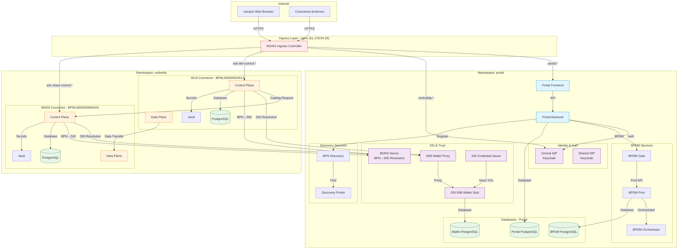
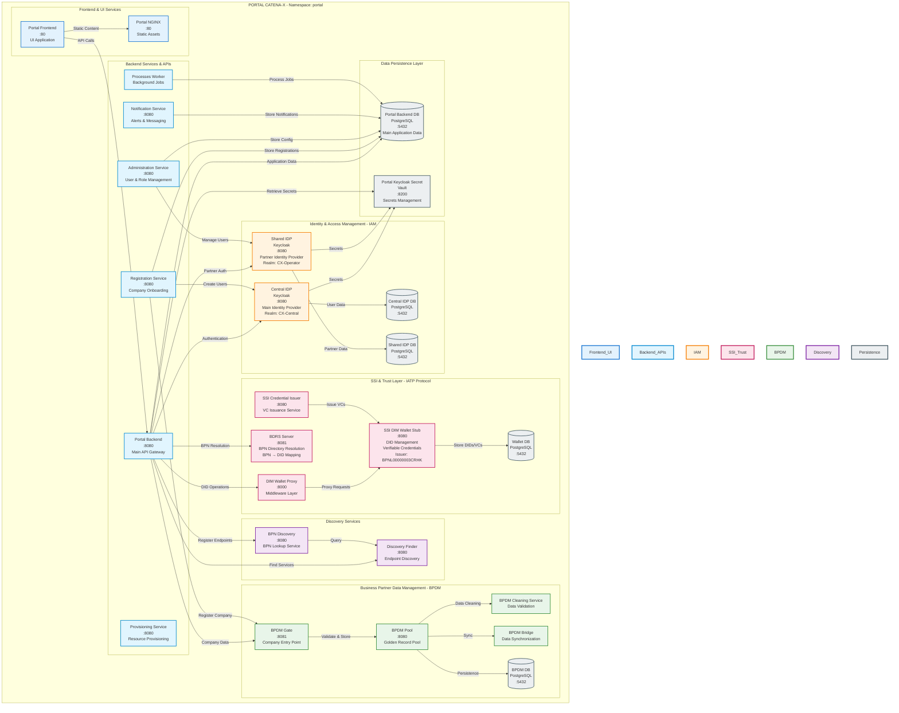
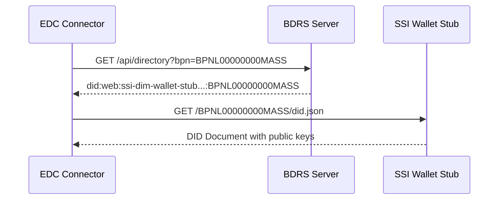

# 1. Arquitectura General del Sistema

## Visión General

El sistema consiste en un despliegue completo del ecosistema Catena-X que incluye:

1. **Portal Catena-X**: Interfaz web para gestión de participantes y datos
2. **Conectores EDC**: Dos conectores Eclipse Dataspace Components para intercambio de datos
3. **Servicios de Identidad y Trust**: Wallets, DIDs, y resolución BPN→DID
4. **Servicios de Descubrimiento**: BDRS, BPN Discovery, Discovery Finder
5. **Infraestructura**: Keycloak, PostgreSQL, Vault, Ingress

---

## Diagrama de Arquitectura Completa

---

## Arquitectura Detallada del Portal (Namespace: portal)

El siguiente diagrama muestra la arquitectura interna del Portal Catena-X, incluyendo todos los servicios desplegados en el namespace `portal`. Los componentes están agrupados por su función dentro del ecosistema Tractus-X.

### Descripción de los Bloques Funcionales

#### 1. Frontend & UI Services
Servicios de interfaz de usuario que proporcionan la experiencia web del Portal Catena-X.

#### 2. Backend Services & APIs
Conjunto de microservicios que implementan la lógica de negocio del portal, incluyendo onboarding de empresas, gestión de usuarios, notificaciones y aprovisionamiento de recursos.

#### 3. Identity & Access Management (IAM)
Dos instancias de Keycloak que gestionan la autenticación y autorización:
- **Central IDP**: Para usuarios del operador del dataspace
- **Shared IDP**: Para usuarios de empresas participantes

#### 4. SSI & Trust Layer (IATP Protocol)
Capa de identidad auto-soberana que implementa el protocolo IATP (Identity and Trust Protocol) de Tractus-X:
- **DIM Wallet Stub**: Gestión de DIDs (Decentralized Identifiers) y VCs (Verifiable Credentials)
- **BDRS**: Resolución de BPN (Business Partner Number) a DID
- **Credential Issuer**: Emisión de credenciales verificables

#### 5. Business Partner Data Management (BPDM)
Servicios para la gestión del "Golden Record" de datos de socios comerciales, incluyendo validación, limpieza y sincronización de datos empresariales.

#### 6. Discovery Services
Servicios de descubrimiento para localizar endpoints y resolver BPNs en el dataspace.

#### 7. Data Persistence Layer
Bases de datos PostgreSQL y Vault para almacenamiento persistente de datos de aplicación, identidades y secretos.

---

## Componentes Principales por Namespace

### Namespace: `portal`

| Componente | Propósito | URL Externa |
|------------|-----------|-------------|
| Portal Frontend | Interfaz web de usuario | http://portal.51.178.94.25.nip.io |
| Portal Backend | API y lógica de negocio | http://portal-backend.51.178.94.25.nip.io/api |
| Central IDP (Keycloak) | Autenticación centralizada | http://centralidp.51.178.94.25.nip.io/auth |
| Shared IDP (Keycloak) | IDP para partners | http://sharedidp.51.178.94.25.nip.io/auth |
| SSI DIM Wallet Stub | Gestión de DIDs y VCs | http://ssi-dim-wallet-stub.51.178.94.25.nip.io |
| DIM Wallet Proxy | Middleware para wallet | Interno |
| BDRS Server | Resolución BPN→DID | http://bdrs-server.51.178.94.25.nip.io |
| BPDM Pool/Gate/Orchestrator | Gestión de Business Partners | http://business-partners.51.178.94.25.nip.io |

### Namespace: `umbrella`

| Componente | Propósito | URL Externa |
|------------|-----------|-------------|
| IKLN Control Plane | Gestión de contratos y catálogos | https://edc-ikln-control.51.178.94.25.nip.io |
| IKLN Data Plane | Transferencia de datos | https://edc-ikln-data.51.178.94.25.nip.io |
| MASS Control Plane | Gestión de contratos y catálogos | https://edc-mass-control.51.178.94.25.nip.io |
| MASS Data Plane | Transferencia de datos | https://edc-mass-data.51.178.94.25.nip.io |

---

## Flujos de Comunicación Principales

### 1. Catalog Request (IKLN → MASS)

Flujo completo de una petición de catálogo desde el conector IKLN (Consumer) al conector MASS (Provider), incluyendo la obtención de credenciales mediante el protocolo IATP.

📄 **Ver diagrama de secuencia completo:** [diagramas/catalog-request-sequence.mmd](diagramas/catalog-request-sequence.mmd)

**Fases del flujo:**
1. **Obtención de Credenciales**: IKLN obtiene VP (Verifiable Presentation) del wallet a través del proxy
2. **Catalog Request con Autenticación**: IKLN envía la petición incluyendo el VP en las cabeceras
3. **Verificación y Respuesta**: MASS verifica las credenciales y devuelve el catálogo

### 2. BPN to DID Resolution

---

## Configuraciones Críticas

### EDC_IAM_DID_WEB_USE_HTTPS

⚠️ **Configuración crítica para la resolución de DIDs**

| Componente | Valor | Razón |
|------------|-------|-------|
| IKLN Control Plane | `false` | Wallet stub está en HTTP |
| MASS Control Plane | `false` | Wallet stub está en HTTP |
| BDRS Server | `false` | Wallet stub está en HTTP |

**Problema resuelto:** IKLN tenía `true` inicialmente, causando errores 502 "Unable to obtain credentials: Empty optional".

### Namespaces y Networking

- **Comunicación intra-namespace:** `<service-name>.<namespace>.svc.cluster.local`
- **Ejemplo:** `http://bdrs-server.portal.svc.cluster.local:8082`
- **Ingress:** NGINX Ingress Controller gestiona todas las URLs externas

---

## Almacenamiento de Datos

### Datos Persistentes (PersistentVolumeClaims)

| Servicio | Namespace | Tamaño | Tipo |
|----------|-----------|---------|------|
| Portal PostgreSQL | portal | 5Gi | csi-cinder-high-speed |
| BPDM PostgreSQL | portal | 3Gi | csi-cinder-high-speed |
| Wallet PostgreSQL | portal | - | - |
| IKLN PostgreSQL | ikln-connector | 5Gi | csi-cinder-high-speed (legacy) |
| MASS PostgreSQL | mass-connector | 5Gi | csi-cinder-high-speed (legacy) |

⚠️ **Nota:** Los conectores en namespace `umbrella` usan `emptyDir` (efímero). Los PVCs en `ikln-connector` y `mass-connector` son legacy.

### Datos Efímeros (emptyDir)

- BDRS Server (datos en memoria, se pierden al reiniciar)
- Conectores EDC en namespace umbrella (si usan emptyDir)

---

## Seguridad y Trust

### Certificados TLS

- **Emisor:** Custom CA para el cluster
- **Secretos:**
  - `edc-ikln-control-tls`
  - `edc-ikln-data-tls`
  - `edc-mass-control-tls`
  - `edc-mass-data-tls`
  - `root-secret`

### Autenticación

- **Portal:** OAuth2/OIDC via Central IDP (Keycloak)
- **EDC Connectors:** Management API con API Key + IATP con DIDs/VPs
- **BDRS:** Token-based con header `x-api-key: TEST`

---

## Diagramas Detallados Adicionales

### 1. Componentes del Portal (Namespace: portal)

Diagrama detallado de todos los servicios desplegados en el namespace `portal`:

📄 **Ver diagrama:** [diagramas/portal-componentes.mmd](diagramas/portal-componentes.mmd)

Incluye:
- Frontend y UI Services
- Backend APIs
- Identity Providers (Keycloak)
- SSI & Trust Layer (Wallet, BDRS, Credential Issuer)
- BPDM Services
- Discovery Services
- Storage Layer (PostgreSQL databases)

---

### 2. Arquitectura del Conector IKLN

Diagrama interno del conector IKLN (Consumer):

📄 **Ver diagrama:** [diagramas/conector-ikln.mmd](diagramas/conector-ikln.mmd)

Incluye:
- Control Plane (Management API, DSP Protocol)
- Data Plane (Data Transfer)
- PostgreSQL y Vault
- Configuración y variables de entorno
- Dependencias externas

---

### 3. Arquitectura del Conector MASS

Diagrama interno del conector MASS (Provider):

📄 **Ver diagrama:** [diagramas/conector-mass.mmd](diagramas/conector-mass.mmd)

Incluye:
- Control Plane (Assets, Policies, DSP Protocol)
- Data Plane (Data Transfer)
- PostgreSQL y Vault
- Data Sources (Dashboard, Sharepoint, Partner Data)
- Configuración y variables de entorno

---

### 4. Diagrama de Subsistemas e Interacciones

Vista de alto nivel de las interacciones entre Portal, IKLN y MASS:

📄 **Ver diagrama:** [diagramas/subsistemas-interacciones.mmd](diagramas/subsistemas-interacciones.mmd)

Muestra:
- Ingress Layer y enrutamiento
- Portal Subsystem (Auth, Trust, Data)
- IKLN Connector Subsystem (Consumer)
- MASS Connector Subsystem (Provider)
- Flujo numerado de interacciones (1-9)

---

### 5. Diagrama de Secuencia: Catalog Request

Secuencia completa de una petición de catálogo desde IKLN a MASS:

📄 **Ver diagrama:** [diagramas/secuencia-catalog-request.mmd](diagramas/secuencia-catalog-request.mmd)

Pasos detallados:
1. Inicio de Catalog Request desde aplicación consumer
2. Resolución BPN → DID via BDRS
3. Obtención de DID Document
4. Obtención de Credenciales (IATP/VP)
5. Catalog Request via DSP Protocol
6. Validación del Consumer (VP signature + VCs)
7. Recuperación de Assets & Policies
8. Catalog Response
9. Respuesta al Consumer
10. Visualización en aplicación

---

## Próximos Pasos

Continúa con:
- **[Capítulo 2: Portal y Componentes](02-portal-componentes.md)** - Detalle de cada servicio del portal
- **[Capítulo 3: Conectores EDC](03-conectores-edc.md)** - Arquitectura interna de los conectores
- **[Capítulo 4: Identidad y Trust](04-identidad-y-trust.md)** - Sistema SSI completo
