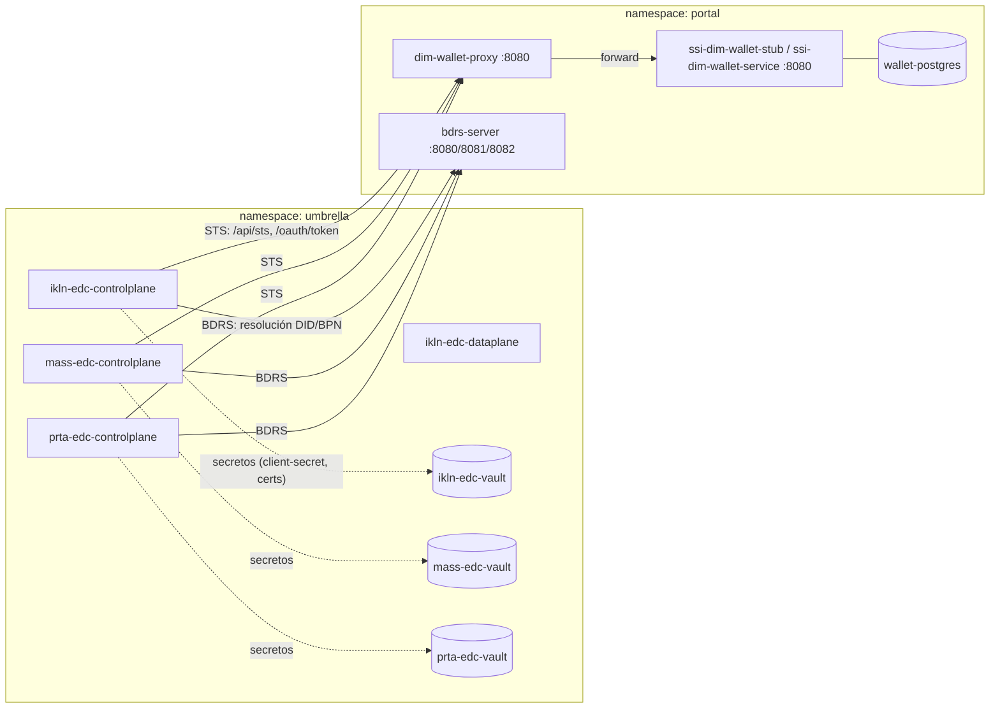

# Piezas del despliegue actual: STS, DCP/IATP, tokens y Vault

**Fecha de análisis:** 2026-09-28

---

## 1. Objetivo del documento

Localizar, dentro del clúster desplegado, dónde se implementan las piezas del protocolo de identidad y confianza descentralizada (DCP, antes IATP) usado por los conectores EDC de Tractus-X:

- **STS** (Secure Token Service / Self-Issued Token Service)
- **DCP / IATP** (Decentralized Claims Protocol)
- **Tokens** (emisión, firma y expiración)
- **Vault** (almacén de secretos)

La información se ha obtenido combinando la salida de `kubectl`/`helm` sobre el clúster real y la revisión de los charts y valores Helm versionados en este repositorio.

---

## 2. Evidencia recogida del clúster

### 2.1 Namespace `umbrella` (conectores EDC)

```
kubectl get pods -n umbrella -o wide
```

Por cada conector (`ikln`, `mass`, `prta`) se despliega el mismo patrón de 5 pods:

| Patrón de pod | Rol |
|---|---|
| `<prefijo>-edc-controlplane-*` | Control Plane del EDC (DCP/IATP, gestión de contratos y políticas) |
| `<prefijo>-edc-dataplane-*` | Data Plane del EDC (transferencia real de datos) |
| `<prefijo>-edc-postgresql-0` | Base de datos del conector (contratos, assets, políticas) |
| `<prefijo>-edc-vault-0` | **Vault propio del conector** (HashiCorp Vault, modo standalone) |
| `<prefijo>-edc-vault-agent-injector-*` | Inyector de secretos de Vault vía sidecar |

```
helm list -n umbrella
```

```
NAME       NAMESPACE   REVISION   CHART                       APP VERSION
ikln-edc   umbrella    3          dataspace-connector-bundle-1.2.1
mass-edc   umbrella    4          dataspace-connector-bundle-1.2.1
prta-edc   umbrella    1          dataspace-connector-bundle-1.2.1
```

Confirma que **cada conector es una instalación Helm independiente** del mismo chart `dataspace-connector-bundle`, cada una con su propio Postgres y su propio Vault — no hay componentes compartidos entre conectores.

### 2.2 Namespace `portal` (identidad y wallet)

```
kubectl get pods -n portal -o wide
kubectl get svc -n portal
helm list -n portal
```

Piezas relevantes para identidad/tokens en `portal`:

| Pod / Service | Rol |
|---|---|
| `ssi-dim-wallet-stub-*` / svc `ssi-dim-wallet-service:8080` | Wallet stub (simula un Managed Identity Wallet / DIM real) |
| `dim-wallet-proxy-*` / svc `dim-wallet-proxy:8080` | Proxy Node.js delante del wallet, intercepta `/api/sts` y `/oauth/token` |
| `wallet-postgres-0` / svc `wallet-postgres:5432` | Base de datos del wallet stub |
| `bdrs-server-*` / svc `bdrs-server:8080,8081,8082` | BPN/DID Resolution Service (resuelve DID ↔ BPN para IATP/DCP) |
| `portal-centralidp-0` / svc `portal-centralidp:80` | Keycloak central (IAM del Portal, no del EDC) |
| `portal-sharedidp-0` | Keycloak compartido (IAM de otros participantes) |
| `portal-ssi-credential-issuer-*` | Emisor de credenciales verificables (VC) del Portal |

Todo el namespace `portal` es una única release Helm `umbrella` (chart `umbrella-3.14.5`), a diferencia de los conectores EDC que van cada uno en su propia release.

---

## 3. STS (Secure Token Service)

No existe un componente etiquetado literalmente como "STS": su función la cumple la combinación **wallet stub + proxy**.

### 3.1 `ssi-dim-wallet-stub`

- Chart: [`charts/identity-and-trust-bundle/values.yaml`](../charts/identity-and-trust-bundle/values.yaml) (dependencia `ssi-dim-wallet-stub`, líneas 23-160).
- Expone los endpoints DCP estándar: `/api/sts`, `/oauth/token`, `/api/v1/directory`, resolución de DIDs (`did:web`), presentación de VCs.
- Parámetros clave:
  - `stubUrl` / `host` / `didHost`: `ssi-dim-wallet-stub.tx.test` (valor por defecto, sobrescrito por dominio real en despliegues OVH).
  - `baseWalletBpn`: `BPNL00000003CRHK` (BPN operador/emisor de confianza).
  - `seeding.bpnList`: BPNs para los que se siembran wallets al arrancar.
  - `tokenExpiryTime: "5"` (segundos) — vida muy corta de los tokens emitidos, típico de tokens SI de un solo uso.
  - Integración opcional con Keycloak (`keycloak.realm: CX-Central`) y con el backend del Portal (`portal.host`, `portal.clientId`).
- Base de datos propia: subchart `postgresql` con `fullnameOverride: wallet-postgres`.

### 3.2 `dim-wallet-proxy`

- Código fuente: [`dim-wallet-proxy/proxy.js`](../dim-wallet-proxy/proxy.js).
- Es un servidor Express que se sitúa **delante** del wallet stub real (`DIM_WALLET_URL`, por defecto `http://ssi-dim-wallet-service.portal.svc.cluster.local:8080`).
- Endpoints implementados:
  - `GET /health` (línea 19)
  - `POST /oauth/token` (línea 24): reenvía la petición de token OAuth2 al wallet, soportando tanto `application/json` como `application/x-www-form-urlencoded`.
  - `app.use('/api/sts', ...)` (línea 142): **intercepta las peticiones STS**, aplicando una estrategia de "REQUEST ENHANCEMENT" + corrección de un bug de firma de tokens (`SIGNTOKEN BUG FIX`, según comentario en el propio código) antes de reenviar a `${DIM_WALLET_URL}/api/sts` (línea 227).
- Los tres conectores EDC desplegados (`ikln`, `mass`, `prta`) **no llaman directamente al wallet stub**, sino a este proxy:
  ```yaml
  # charts/dataspace-connector-bundle/values-ikln-connector.yaml
  sts:
    dim:
      url: http://dim-wallet-proxy.portal.svc.cluster.local:8080/api/sts
    oauth:
      token_url: http://dim-wallet-proxy.portal.svc.cluster.local:8080/oauth/token
  ```

### 3.3 Valor por defecto (sin overrides de proxy)

Cuando no se aplican los valores específicos de conector, el STS apunta directamente al wallet:

```yaml
# charts/dataspace-connector-bundle/values.yaml (líneas 38-44)
sts:
  dim:
    url: http://ssi-dim-wallet-stub.tx.test/api/sts
  oauth:
    token_url: http://ssi-dim-wallet-stub.tx.test/oauth/token
```

```yaml
# charts/umbrella/values.yaml (línea 59)
decentralIdentityManagementAuthAddress: "http://ssi-dim-wallet-stub.tx.test/api/sts"
```

---

## 4. DCP / IATP (Decentralized Claims Protocol, antes Identity And Trust Protocol)

Se configura por conector bajo la clave `tractusx-connector.iatp`, perteneciente al subchart oficial `tractusx-connector` v0.11.1 (empaquetado en `charts/dataspace-connector-bundle/charts/tractusx-connector-0.11.1.tgz`).

### 4.1 Definición base (documentación de valores)

`charts/dataspace-connector-bundle/values.yaml` (líneas 22-90):

```yaml
tractusx-connector:
  iatp:
    id: did:web:ssi-dim-wallet-stub.tx.test:BPNL00000003AZQP
    trustedIssuers:
      - did:web:ssi-dim-wallet-stub.tx.test:BPNL00000003CRHK
    sts:
      dim:
        url: http://ssi-dim-wallet-stub.tx.test/api/sts
      oauth:
        token_url: http://ssi-dim-wallet-stub.tx.test/oauth/token
        client:
          id: BPNL00000003AZQP
          secret_alias: client-secret
  participant:
    id: BPNL00000003AZQP
  controlplane:
    env:
      TX_IAM_IATP_CREDENTIALSERVICE_URL: http://ssi-dim-wallet-stub.tx.test/api
      EDC_IAM_DID_WEB_USE_HTTPS: false
    bdrs:
      server:
        url: http://ssi-dim-wallet-stub.tx.test/api/v1/directory
```

Campos clave:
- `iatp.id`: DID propio del conector (`did:web:<host>:<BPN>`).
- `iatp.trustedIssuers`: lista de DIDs de emisores de confianza cuyas credenciales acepta el conector.
- `sts.*`: endpoints de emisión de tokens (ver sección STS).
- `participant.id`: BPN del participante dueño del conector.
- `controlplane.env.TX_IAM_IATP_CREDENTIALSERVICE_URL`: URL del "Credential Service" DCP (parte del wallet) para solicitud/presentación de credenciales.
- `controlplane.bdrs.server.url`: servicio BDRS para resolver DID ↔ BPN.

### 4.2 Overrides reales por conector desplegado

| Conector | Archivo de valores | BPN | DID (`iatp.id`) |
|---|---|---|---|
| `ikln-edc` | [`charts/dataspace-connector-bundle/values-ikln-connector.yaml`](../charts/dataspace-connector-bundle/values-ikln-connector.yaml) | `BPNL00000002IKLN` | `did:web:ssi-dim-wallet-stub.51.178.94.25.nip.io:BPNL00000002IKLN` |
| `mass-edc` | `charts/dataspace-connector-bundle/values-mass-connector.yaml` | (análogo, BPN de MASS) | (análogo) |
| `prta-edc` | `charts/dataspace-connector-bundle/values-prta-connector.yaml` | (análogo, BPN de PRTA) | (análogo) |

Extracto real (`values-ikln-connector.yaml`, líneas 30-52):

```yaml
iatp:
  id: did:web:ssi-dim-wallet-stub.51.178.94.25.nip.io:BPNL00000002IKLN
  trustedIssuers:
    - did:web:ssi-dim-wallet-stub.51.178.94.25.nip.io:BPNL00000003CRHK
  sts:
    dim:
      url: http://dim-wallet-proxy.portal.svc.cluster.local:8080/api/sts
    oauth:
      token_url: http://dim-wallet-proxy.portal.svc.cluster.local:8080/oauth/token
      client:
        id: BPNL00000002IKLN
        secret_alias: edc-wallet-secret
controlplane:
  env:
    TX_IAM_IATP_CREDENTIALSERVICE_URL: http://dim-wallet-proxy.portal.svc.cluster.local:8080/api
    EDC_IAM_DID_WEB_USE_HTTPS: false
    TX_EDC_IAM_IATP_BDRS_SERVER_URL: http://bdrs-server.portal.svc.cluster.local:8082/api/directory
    TX_EDC_IAM_IATP_BDRS_CACHE_VALIDITY: "600"
    EDC_IAM_STS_OAUTH_TOKEN_SIGNING_ALGORITHM: "ES256K"
  bdrs:
    server:
      url: http://bdrs-server.portal:8082/api/directory
```

Nótese el comentario explícito en el propio fichero:
```yaml
# BDRS configuration with new property names (EDC v0.11.1+)
```
que documenta que las variables `TX_EDC_IAM_IATP_BDRS_*` sustituyen a las antiguas al pasar a `tractusx-connector` 0.11.1.

### 4.3 BDRS (BPN/DID Resolution Service)

- Pod/servicio: `bdrs-server` en `portal` (puertos 8080/8081/8082).
- Rol: resolver el DID de un participante a partir de su BPN (y viceversa), necesario para que el DCP/IATP localice el Credential Service correcto del interlocutor durante una negociación.
- Referenciado desde cada conector vía `controlplane.bdrs.server.url` y las env vars `TX_EDC_IAM_IATP_BDRS_*`.

---

## 5. Tokens

| Aspecto | Dónde se configura | Valor |
|---|---|---|
| Algoritmo de firma de tokens SI | `controlplane.env.EDC_IAM_STS_OAUTH_TOKEN_SIGNING_ALGORITHM` en cada `values-*-connector.yaml` | `ES256K` |
| Tiempo de expiración de tokens del wallet | `charts/identity-and-trust-bundle/values.yaml` → `wallet.tokenExpiryTime` | `"5"` segundos |
| Client id/secret OAuth2 para acceso a DIM | `iatp.sts.oauth.client.id` + `iatp.sts.oauth.client.secret_alias` (por conector) | BPN del conector + alias de secreto en Vault (p. ej. `edc-wallet-secret`) |
| Endpoint de emisión SI token | `iatp.sts.dim.url` | `http://dim-wallet-proxy.portal.svc.cluster.local:8080/api/sts` |
| Endpoint de emisión OAuth2 token | `iatp.sts.oauth.token_url` | `http://dim-wallet-proxy.portal.svc.cluster.local:8080/oauth/token` |
| Autenticación de gestión del EDC (no DCP) | `controlplane.endpoints.management.authKey` | Clave `X-Api-Key` distinta por conector (p. ej. `ikln-api-key-change-in-production`) |

El **secreto real del cliente OAuth** (`client-secret` / `edc-wallet-secret`) no está en claro en los values: se resuelve en tiempo de ejecución contra el **Vault propio de cada conector** (ver sección 6).

---

## 6. Vault

Cada conector EDC despliega **su propio HashiCorp Vault** — no hay un Vault centralizado compartido entre `ikln-edc`, `mass-edc` y `prta-edc`.

### 6.1 Declaración de la dependencia

`charts/dataspace-connector-bundle/Chart.yaml` (líneas 36-39):

```yaml
dependencies:
  - name: vault
    version: 0.27.0
    repository: https://helm.releases.hashicorp.com
    condition: vault.enabled
```

Empaquetado localmente en `charts/dataspace-connector-bundle/charts/vault-0.27.0.tgz`.

### 6.2 Configuración por defecto

`charts/dataspace-connector-bundle/values.yaml` (líneas 212-226):

```yaml
vault:
  enabled: true
  server:
    postStart:
      - sh
      - -c
      - |-
        {
        sleep 5
        /bin/vault kv put secret/client-secret content=kEmH7QRPWhKfy8f+x0pFMw==
        /bin/vault kv put secret/aesKey content=YWVzX2VuY2tleV90ZXN0Cg==
        }
    standalone:
      enabled: true
```

- Modo **standalone** (no HA, un único pod `*-edc-vault-0`), consistente con lo visto en `kubectl get pods -n umbrella`.
- El hook `postStart` siembra automáticamente dos secretos de ejemplo al arrancar: `secret/client-secret` y `secret/aesKey` (valores de test, no aptos para producción).
- Cada instalación Helm despliega además `*-edc-vault-agent-injector-*`, el componente que inyecta secretos como variables/ficheros en los pods del conector vía sidecar (patrón estándar de Vault Agent Injector).

### 6.3 Conexión del EDC al Vault

`charts/dataspace-connector-bundle/values.yaml` (líneas 168-182):

```yaml
tractusx-connector:
  vault:
    hashicorp:
      url: "http://{{ .Release.Name }}-vault:8200"
      token: "root"
      paths:
        secret: /v1/secret
        folder: ""
```

- URL templada con `{{ .Release.Name }}`, de modo que cada release (`ikln-edc`, `mass-edc`, `prta-edc`) resuelve automáticamente a su propio servicio `<release>-vault:8200` (coincide con los `ClusterIP` vistos: `ikln-edc-vault`, `mass-edc-vault`, `prta-edc-vault`, puertos `8200/8201`).
- Token **root** hardcodeado (`"root"`) — válido para entornos de test/sandbox como este, pero a revisar antes de cualquier uso productivo.
- El alias `secret_alias: edc-wallet-secret` usado en el `iatp.sts.oauth.client` de cada conector se resuelve leyendo `secret/edc-wallet-secret` (o similar) de este mismo Vault.

### 6.4 Vaults presentes en el clúster (namespace `umbrella`)

| Release | Vault (StatefulSet) | Servicio | Puertos |
|---|---|---|---|
| `ikln-edc` | `ikln-edc-vault-0` | `ikln-edc-vault`, `ikln-edc-vault-internal` | 8200 (API), 8201 (cluster) |
| `mass-edc` | `mass-edc-vault-0` | `mass-edc-vault`, `mass-edc-vault-internal` | 8200, 8201 |
| `prta-edc` | `prta-edc-vault-0` | `prta-edc-vault`, `prta-edc-vault-internal` | 8200, 8201 |

No existe ningún Vault en el namespace `portal`: el wallet stub y el proxy no usan HashiCorp Vault, gestionan sus propios secretos/config vía variables de entorno y Postgres (`wallet-postgres`).

---

## 7. Mapa de flujo (resumen visual)



---

## 8. Conclusiones

1. **STS** no es un servicio propio, sino un endpoint (`/api/sts`) servido por el `ssi-dim-wallet-stub` y **interceptado/parcheado** por `dim-wallet-proxy` antes de llegar a los conectores.
2. **DCP/IATP** se configura íntegramente vía Helm values (`tractusx-connector.iatp.*`) de forma independiente para cada uno de los tres conectores (`ikln`, `mass`, `prta`), cada uno con su propio DID, BPN y `trustedIssuers`.
3. **Tokens**: firmados con `ES256K`, de vida muy corta (5s en el wallet stub), emitidos a través del proxy `dim-wallet-proxy`.
4. **Vault**: no centralizado — **un HashiCorp Vault standalone por conector**, con token root y secretos de ejemplo sembrados automáticamente al arrancar (`client-secret`, `aesKey`); es el origen del secreto usado en `iatp.sts.oauth.client.secret_alias`.
5. Todo el subsistema de identidad (`portal`) es una única release Helm (`umbrella-3.14.5`), mientras que cada conector EDC vive en una release Helm separada del chart `dataspace-connector-bundle-1.2.1`.

---

## 9. Referencias a ficheros del repositorio

- [`charts/dataspace-connector-bundle/values.yaml`](../charts/dataspace-connector-bundle/values.yaml) — valores base IATP/STS/Vault del chart de conector.
- [`charts/dataspace-connector-bundle/Chart.yaml`](../charts/dataspace-connector-bundle/Chart.yaml) — dependencias (`tractusx-connector`, `postgresql`, `vault`).
- [`charts/dataspace-connector-bundle/values-ikln-connector.yaml`](../charts/dataspace-connector-bundle/values-ikln-connector.yaml) — overrides reales del conector IKLN.
- [`charts/identity-and-trust-bundle/values.yaml`](../charts/identity-and-trust-bundle/values.yaml) — configuración del wallet stub (`ssi-dim-wallet-stub`).
- [`dim-wallet-proxy/proxy.js`](../dim-wallet-proxy/proxy.js) — implementación del proxy STS/OAuth.
- [`charts/umbrella/values.yaml`](../charts/umbrella/values.yaml) — valor por defecto `decentralIdentityManagementAuthAddress`.
